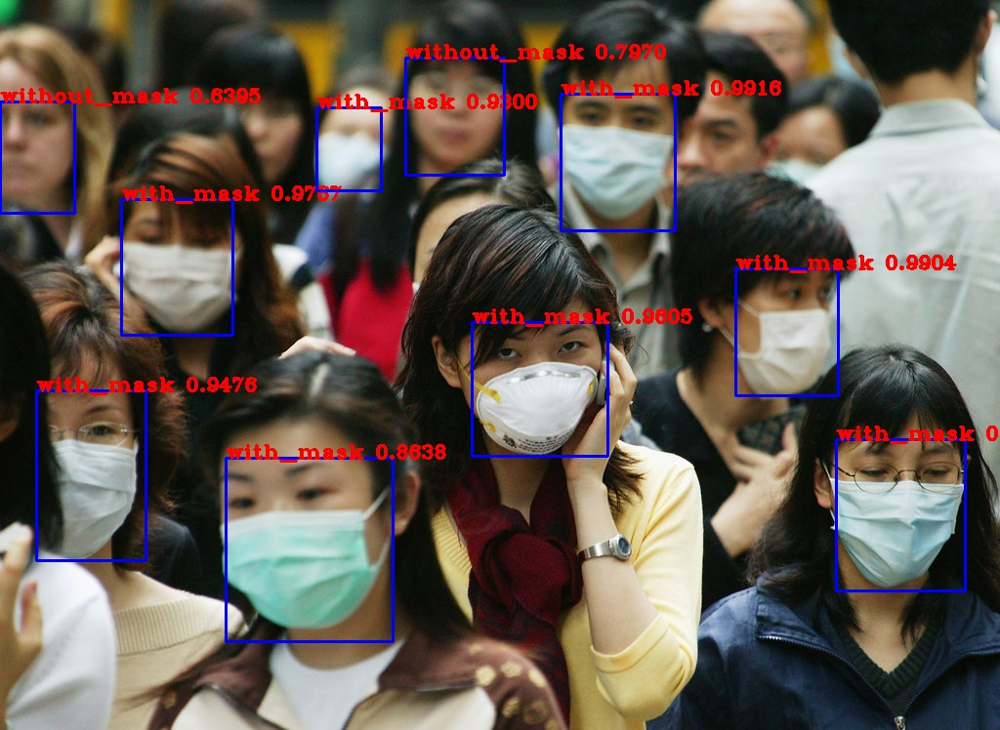

# Face Mask Detector

[](https://colab.research.google.com/github/varun0603/yolo-facemaskDetection/blob/master/YoloFaceMaskDetector.ipynb)

* Implemented You Only Look Once (YOLO) algorithm in tensorflow 2.0
* Used Darknet yolo weights trained on COCO dataset which has 80 classes
* Implemented Transfer learning on FaceMask dataset to detect persons with masks in a live video stream


## YOLO Complete layer architecture


## Usage

* Download the pre-trained yolo weights from https://pjreddie.com/media/files/yolov3.weights or
```bash
> git clone https://github.com/varun0603/yolo-facemaskDetection.git
> cd ./yolo-facemaskDetection
> wget https://pjreddie.com/media/files/yolov3.weights -O weights/yolov3.weights
```

## Detection

For detection run the following command with the corresponding parameters
```bash
> python detect.py --weights ./tf-ckpts --video 0
```

command line parameters

- classes path to classes file
- weights path to weights file
- size to resize the image default is 416
- video 0 for webcam or path for the video file
- output path for the output video
- output_format codec used in VideoWriter when saving video to file
- num_classes number of classes in the model (default is 3)

## Sample Output
